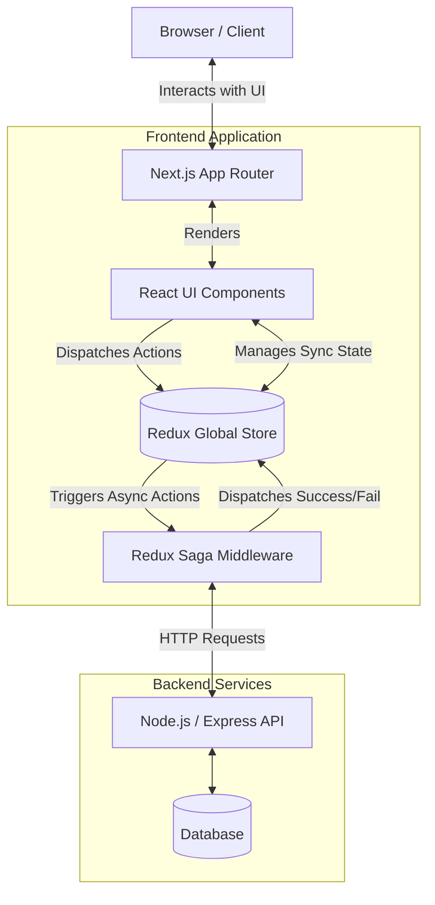
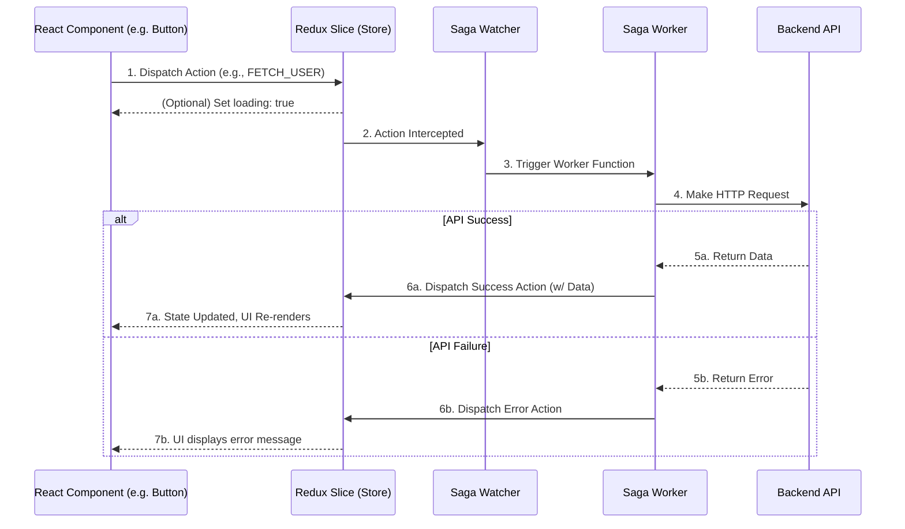
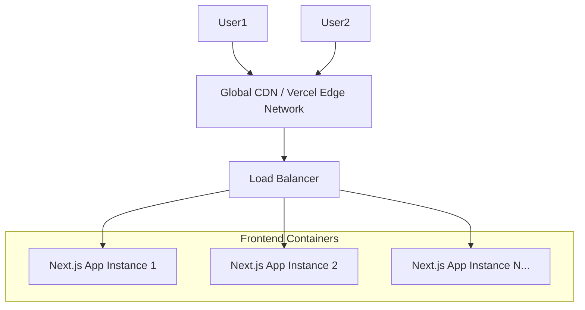

# Gaea Gold WebUI Architecture & Scaling Documentation

This document provides a comprehensive, deep-dive into the architecture, folder structure, state management, and scaling strategies for the Gaea Gold WebUI application. It is designed to be accessible to both technical stakeholders and new developers.

---

## 1. High-Level Architecture Overview

The application is built on a modern, robust, and scalable stack centered around React and Next.js. 



### Core Technologies:
*   **Next.js 16 (App Router)**: Handles routing, server-side rendering (SSR), and static site generation (SSG) for optimal performance and SEO.
*   **React 19 & TypeScript**: Provides a component-based UI architecture with strong type safety to prevent runtime errors.
*   **Tailwind CSS 4 & Framer Motion**: Delivers the premium, highly aesthetic styling and complex animations.
*   **Redux Toolkit & Redux Saga**: Manages complex global application state and side-effects (like API calls).

---

## 2. Directory and File Structure Explained

Next.js uses a highly opinionated folder structure where the file system represents the application routing and architecture.

```mermaid
graph LR
    Root[gaeagold-webui/]
    
    Root --> App[app/ : Pages & Routing]
    Root --> Components[components/ : Reusable UI]
    Root --> Stores[stores/ : Redux State]
    Root --> Sagas[sagas/ : Async Logic]
    Root --> Lib[lib/ : Integrations]
    
    App --> Auth[(auth) / login, register]
    App --> Protected[(protected) / dashboard, profile]
    App --> Public[(public) / products, landing]
    
    Components --> UI[ui/ : Buttons, Inputs]
    Components --> Sections[sections/ : Hero, Galleries]
    
    Stores --> Slices[productSlice.ts, cartSlice.ts]
    Sagas --> Watchers[appSaga.js]
```

### Detailed Folder Responsibilities:

| Folder / File | Purpose | Why it exists |
| :--- | :--- | :--- |
| **`/app`** | The core Next.js router. Defines all URLs. | Keeps routing predictable. Route groups like `(public)` allow applying layouts without changing the URL structure. |
| **`/app/layout.tsx`** | The root layout. Wraps every page. | Used to inject global providers (Redux, Theme), Navbars, and Footers across the whole site. |
| **`/components`** | Reusable React components. | Prevents code duplication. Keeps page files small and readable by composing UI from smaller blocks. |
| **`/components/ui/`** | Generic components (Buttons, Cards). | Forms the base "Design System" of the app. |
| **`/components/sections/`**| Large page blocks (Hero Section). | Allows easy reordering or reuse of major UI chunks across different pages. |
| **`/stores`** | Redux configuration and state slices. | Centralizes application data (like the shopping cart) so it isn't lost when navigating between pages. |
| **`/sagas`** | Redux Saga files. | Separates complex, asynchronous logic (like waiting for API calls) from the UI components. |
| **`/lib`** | Third-party integrations (Axios, etc.). | A dedicated place for setup code that connects the app to the outside world. |

---

## 3. State Management & Data Flow (Redux + Saga)

The application uses a unidirectional data flow. UI components do not fetch data directly; they ask the Redux Store to do it for them.

### Data Flow Diagram



### How it Works in Practice:
1.  **Slices (`/stores/productSlice.ts`)**: Define what the data looks like (e.g., an array of products) and the synchronous actions to change it.
2.  **Sagas (`/sagas/appSaga.js`)**: These are background tasks running constantly. 
    *   *Watchers* listen for specific actions.
    *   *Workers* execute the actual API call when triggered by a watcher, then dispatch a new action back to the Slice with the retrieved data.

---

## 4. Scalability Strategy

As the application grows to handle more users, more products, and more developers, the architecture is designed to scale across several dimensions.

### A. Performance Scaling
*   **Server-Side Rendering (SSR)**: Next.js renders initial HTML on the server. This means mobile devices don't have to download huge JavaScript files to see the page, resulting in massive performance gains and perfect SEO.
*   **Image Optimization**: The Next.js `<Image />` component automatically resizes, compresses (to WebP/AVIF), and lazy-loads images, saving massive amounts of bandwidth.
*   **Code Splitting**: Next.js only sends the JavaScript necessary for the specific page the user is viewing, keeping load times consistently low regardless of app size.

### B. Codebase Scaling
*   **Modular Components**: Because everything is broken into `/components/ui` and `/components/sections`, adding new pages is as simple as snapping together existing Lego blocks.
*   **TypeScript**: As the team grows, TypeScript ensures developers know exactly what data a component requires, preventing thousands of potential bugs before the code is even run.
*   **Redux Slice Pattern**: Instead of one giant state file, state is split into "slices" (Cart, User, Products). New features (like a "Wishlist") simply get their own isolated slice without affecting the rest of the application.

### C. Infrastructure Scaling


*   **Edge Deployment (Vercel)**: Next.js is designed to be deployed to the Edge. Static assets and pages are cached globally on CDN nodes close to the user, meaning a user in Tokyo gets the same instant load times as a user in New York.
*   **Docker Containerization**: The repository includes a `Dockerfile`. This means the application is completely isolated and can be deployed to AWS ECS, Kubernetes, or Google Cloud Run, automatically spinning up hundreds of instances during high-traffic events (like a major product launch) and scaling down when traffic drops.
